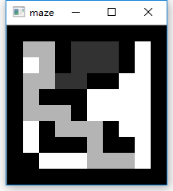

## 迷宫自动寻路

### 步骤

1.首先读取maze.jpg并转换成文本，墙用1表示，路用0表示，见maze.txt

2.读取文本转换成二维数组，迷宫用numpy二维数组表示

3.用深度优先搜索DFS算法进行寻路

4.每次寻路，更新迷宫数组，用cv2将数组当作图片输出

### 算法说明

采用**深度优先搜索**

起点入栈;

while( true){

​	栈顶第一个点作为当前点;

​	if (当前点是终点)

​		跳出循环;

​	elif (当前点周围有路可走)

​		当前点得到下一个位置点;

​		下一个位置点入栈;

​	elif (当前点无路可走)

​		栈顶元素弹出;

}

### 知乎链接

[可以用 Python 编程语言做哪些神奇好玩的事情](https://www.zhihu.com/question/21395276/answer/473850197)

### 效果图

左上角是起点，右下角是终点。

